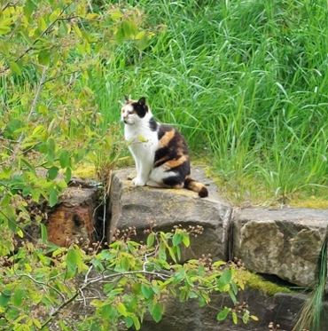
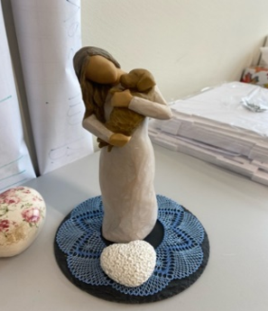
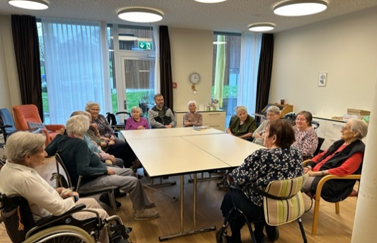
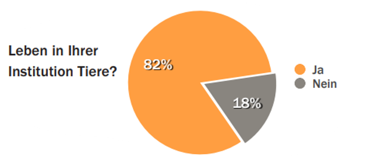
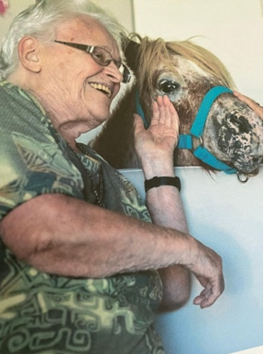
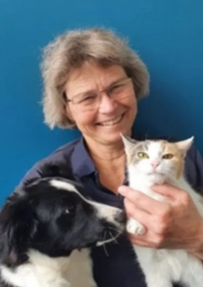
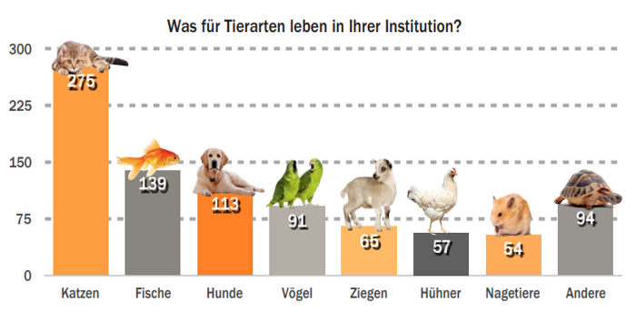
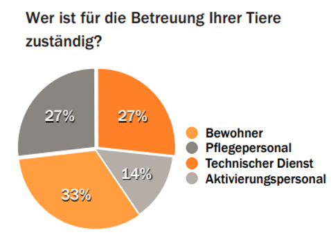

+++
title = "Durch Tiere länger leben - Wunschgedanke oder Realität ?"
date = "2024-05-17"
draft = false
pinned = false
tags = ["Deutsch", "Reportage"]
+++
# Durch Tiere länger leben – Wunschgedanke oder Realität?

 Die Einsamkeit und Unbeholfenheit können im Alter ein ständiger Begleiter sein. Es ist nachgewiesen, dass Einsamkeit gleich lebensverkürzend wirkt wie das Rauchen. Um dem entgegenzuwirken und die Lebensqualität im Alter zu verbessern, wird nun oft das Zusammenleben mit Tieren gefördert. Denn Tiere bieten Hilfe, begleiten und verstehen einen besser als manche Menschen. 

**Von Angela Deloséa und Clémentine Verschelde** 

Ein leises Schleichen, kleine über den Boden tappende Pfoten, ein Windstoss und schon befindet sich die Katze Kaja auf dem Bett einer Bewohnerin. Täglich schleicht Kaja von Zimmer zu Zimmer und lässt sich von allen Bewohnerinnen und Bewohnern verwöhnen. In jedem Zimmer ist es ihr sehr heimelig und sie geniesst es, sich von allen streicheln zu lassen, wobei sie oft schnurrt und auch durchaus häufig einschläft. Kaja wird täglich mit viel Liebe und Aufmerksamkeit überhäuft. Sie vermittelt den Bewohnerinnen und Bewohnern des Pflegeheims Riggishof aber auch Herzenswärme und vor allem Gemütlichkeit, wenn sie ruhig auf den Betten schläft. Das Pflegeheim Riggishof ist ihr Zuhause und die Bewohnerinnen und Bewohner sowie das Pflegepersonal sind ihre Familie.

#### Das Pflegeheim Riggishof

Ein Pflegeheim liegt zwischen Wiesen, Höfen und kleinen Häusern. Wohlige Gefühle überfliegen uns direkt. Das Pflegeheim Riggishof ist fröhlich eingerichtet und vom Personal werden wir mit offenen Armen begrüsst. Anhand der Einrichtung erkennt man sofort, dass hier Tiere für die Leute nicht nur draussen in der nahe gelegenen Umgebung eine gewisse Rolle spielen, sondern auch im Inneren des Pflegeheimes. Immer wieder treffen wir auf Dekorationsstücke, welche die enge Beziehung zwischen Menschen und Tieren darstellen. 

#### Das Treffen mit den Senioren

Wir treffen auf eine Gruppe von neun Frauen und einem Mann, welche hier wohnen oder an manchen Tagen der Tagesstätte beitreten, um nicht einsam zu sein. Es ist etwas schwierig mit ihnen ins Gespräch zu kommen, einerseits, weil sie teils schlecht hören oder auf Fragen nicht 

eingehen können, andererseits weil sie abschweifen und lieber von früher erzählen. Was kürzlich passiert ist, ist rasch wieder vergessen. Von mehreren Bewohnerinnen erfahren wir jedoch, dass sie Tiere mögen und gerne mit ihnen Zeit verbringen. Eine Frau erzählt uns sogar, sie wünschte sich, es kämen öfters Tiere ins Heim. Nicht alle wollen sich noch im Alter ein Tier anschaffen: 

> «Ich will mir kein Tier im Alter anschaffen, denn ich weiss nicht, was mit diesem nach meinem Tod geschehen würde.» 

Diese Aussage einer Bewohnerin weist drauf hin, dass Tiere im Altersheim eine gute Sache sind, denn die Bewohner können ihr Leben mit Tieren geniessen, ohne sich Sorgen zu machen, wie es für das Tier nach dem eigenen Tod weiter geht. Auf diese Behauptung bekommen wir eine hundertprozentige Zustimmung der Gruppenteilnehmer.

#### Die Bedeutung von Haustieren für das seelisch Erleben von älteren Menschen

Alle um uns sind freundlich und hilfsbereit, ebenfalls merken wir direkt, hier kennt jeder jeden, aufgrund dessen können wir uns kaum vorstellen, dass hier jemand Einsamkeit verspüren könnte. Dies ist allerdings doch 

oftmals der Fall, zum einen, wenn man beginnt schlechter zu hören oder auch durch beginnende Demenz weniger schnell in Gesprächen mitkommt. Man fühlt sich dann oft ausgeschlossen und dies führt zu Einsamkeit. Aber auch der Verlust von Angehörigen und Freunden bewirkt ein Einsamkeitsgefühl. Laut einer Studie eines chinesischen Forschungsteams führt Einsamkeit zu einem 14-prozentig höheren Sterberisiko. Das erhöhte Sterberisiko liege an einer verstärkten Ausschüttung des Stresshormons Cortisol, was die Körperfunktionen auf Dauer beeinflusse.*(Quelle 1: A systematic review and metaanalysis of 90 cohort studies of social isolation, loneliness and mortality; Fan Wang, Nature Human Behaviour 7)*. Deswegen versuchen immer mehr Alters- und Pflegeheime das Einsamkeitsgefühl in älteren Menschen zu verringern, indem man die Gelegenheit gibt, sich mit Tieren zu beschäftigen. Tiere wirken gegen die Einsamkeit, sie sind die besten 

 

Cortisol ist ein Hormon, welches in unseren Nebennieren produziert wird. Es regelt den Schlaf und den Stoffwechsel, macht uns belastbar und fit. Wenn es jedoch passiert, dass unser Körper, über ein längeren Zeitraum zu viel Cortisol ausstösst, wird unser Alltag stressig und beschwerlich. Was zu hohen emotionalen Belastungen, Depressionen oder zu einem früheren Tod führen kann.

*Quelle 3: Wie Cortisol und Stress zusammenhängen (aok.de)*



Zuhörer und geben älteren Menschen das Gefühl, gebraucht zu werden. Eine Tier-Mensch Beziehung ist viel mehr als nur eine Freundschaft, sie ist oftmals sogar inniger als eine Mensch-Mensch Beziehung. Nach dem Buch «Leben mit Tieren im Alter», geschrieben von Marianne Gäng und Dennis C. Turner *(Quelle 2)* können Haustiere ihre Vitalität auf den Menschen übertragen. Das Verhalten der Tiere hat Einfluss auf die Stimmung der Besitzer. Beim Beobachten der Tiere im Freien wird deutlich, dass sich das Lächeln der Menschen nicht vermeiden lässt. Ebenfalls konnten in wissenschaftlichen Untersuchungen belegt werden, dass das Streicheln eines eigenen Tieres den Blutdruck senkt. 

#### Verbesserung der Kommunikation älterer Menschen mit Hilfe von Tieren

Wir erfahren von den Pflegenden des Altersheimes Riggishof, dass regelmässig ein Pony auf Besuch kommt, mit dem Lift bis auf die Stockwerke hochgebracht wird und auch die Zimmer der Bewohnenden aufsucht. Dies führt zu viel Lachen und Fröhlichkeit bei den Bewohnenden und erinnert an frühere Zeiten, weil die Bewohnenden aus dieser ländlichen Umgebung auch oft Pferde hielten, oder sie in der Landwirtschaft für die Arbeiten auf dem Hof eingesetzt haben. 

> „Die Bewohnenden fallen unserem Pony wortwörtlich um den Hals und möchten es am liebsten überall streicheln. So dass wir ihnen manchmal sagen müssen, dass sie es ruhiger angehen sollen, denn man muss natürlich bedenken, dass es immer noch ein Tier ist.“

So erzählt uns Sabrina Lang, eine junge Pflegende des Riggishofs, welche im Bereich Demenz arbeitet. Der Hund des Heimleiters kann bei einer an Demenz erkrankten Bewohnerin, welche oft mit gesenktem Kopf dasitzt und nicht mehr verbal Kontakt aufnimmt, bewirken, dass sie den auf ihrem Schoss liegenden Hundekopf zu streicheln beginnt und ins Reden gerät. 

> «Auch mir tun die Tiere hier im Heim gut. In stressigen Zeiten können sie mich direkt beruhigen. Sie haben eindeutig eine gewisse Wirkung auf uns Menschen!»

 berichtet Alice Oesch Leitung, Administration und Finanzen des Pflegeheims Riggishof, begeistert. 

#### Mitbringen eines eigenen Haustieres ins Pflegeheim

Leider ist es im Pflegeheim finanziell und auch oft zeitlich nicht möglich, dass die Angestellten die Pflege von Tieren übernehmen könnten, sagt Alice Oesch. Die Haltung von einem eigenen Haustier wäre unter Umständen nach Rücksprache mit der Heimleitung erlaubt. Da viele Menschen ins Pflegeheim eintreten, wenn sie schon selbst viel Hilfe benötigen, ist dies oft nicht mehr der Fall. Immer wieder werden sie aber durch Partner oder Familienangehörige mit ihrem ehemaligen Haustier besucht und verbringen zumindest Stunden in ihrem Zimmer mit den Tieren. So wurde auch schon eine geliebte Katze zu einem Mann gebracht, welcher im Sterben lag, was ihn sehr beruhigte. 

#### Kontroverse Meinungen

Es gibt auch wenige, welche nicht dafürstehen, Tiere in Altersheimen unterzubringen auf Grund von hygienischen Gründen oder auch Gefahren. Dies sollte jedoch heutzutage keine Rolle mehr spielen. Denn Tierärzte sind in der heutigen Zeit so weit fortgeschritten, dass sie jegliche Impfungen und Entwurmungen für Tiere entwickelt haben. Laut Ursula Ohnewein, Tierärztin in der Tierarztpraxis Längenberg, die sich bereits intensiv mit unserem Thema befasst hat, als sie sich mit der Masterarbeit «Katzen im Alters- und Pflegeheim – Ein Beitrag zu Spiritual Care» auseinandergesetzte. In der Praxis von Frau Doktor Ohnewein begleitet sie Tier und Besitzer bis ins hohe Alter. Frau Ohnewein berichtet mit Freude ihre Patienten und deren Besitzer auf dem Lebensweg zu begleiten. 

> «Natürlich können durch Tiere gewisse Gefahren entstehen, jedoch gibt es zu viele gute Vorteile, welche die Nachteile vergessen lassen.», bestätigt Ursula Ohnewein aus Erfahrung.

#### Tiere im Alltag der Pflegenden

 Es ist jedoch zu bedenken, dass Tiere im Alltag der Pflegenden ein Störfaktor (z.B. wegen Tierallergien) sein können, oder dass manche ältere Menschen Angst vor Tieren haben und sich gestresst fühlen, wenn sie mit Tieren in Kontakt kommen. Sabrina Lang hat uns umfassend informiert und alle unsere Fragen beantwortet. Sie betonte, dass sie sehr zufrieden damit sei, dass das Pflegeheim Tiere integriert und dass sie selbst als Kind Haustiere hatte. Für sie gibt es keinen Störfaktor außer der regelmäßigen Fütterung der Tiere. Die Aufgaben werden jedoch unter den Teams aufgeteilt, zum Beispiel zwischen Restauration, Pflege und so weiter.

#### Die verschiedenen Zuneigungen zu Tieren

Natürlich verspüren nicht alle Bewohner: innen eine gleiche Zuneigung zu Tieren. Es kommt immer auf den Menschen an, wie ein Tier besuch aufgenommen wird. Erfahrungen, welche man in seinem früheren Leben mit Tieren gemacht hat, prägen nun sicherlich auch eine Wirkung eines Tieres. Wenn manche Bewohner: innen Tiere fürchten, versuchen sie oft, diese zu ignorieren oder ihnen aus dem Weg zu gehen. Wie Sabrina Lang es formuliert: 

> ‚‚Es kommt vor, dass eine ältere Person eine Katze aus einem Sessel schubst, weil sie sich ungestört hinsetzen will." 

Nicht nur Furcht spielt eine Rolle.  Manche Menschen hatten einfach ihr ganzes Leben nie etwas zu tun mit Tieren, was sich nun auch teilweise am Interesse solcher Tierbesuche feststellen lässt. Auch kommt es oft einfach auf die Tierart drauf an, nicht jeder Strahlt gleichfest bei z.B. einem Hundebesuch, weil Katzen ihnen halt lieber sind. 

#### Geeignete Tierarten für älter Personen

In Altersheimen kommen in der Regel verschiedene Tierarten vor. Am häufigsten sind Katzen oder auch Hundebesuche. Eine Katze ist jedoch in vielerlei Hinsicht besser geeignet als ein Hund. Sie ist autonom und erfordert von den Pflegenden deutlich weniger Aufwand als ein Hund oder Kaninchen, die wöchentlich ausgemistet werden müssen. 

> „Ein Tier, welches immer da ist im Alltag und auch, welches mit dem Bewohner kommunizieren kann, bringt den Bewohnern mehr als ein Tier, mit dem diese Dinge nicht möglich sind“, erklärt uns Ursula Ohnewein.

 Eine Bewohnerin hat uns mitgeteilt, dass sie sich wünsche, mehrere Tiere zu haben, die bei ihr bleiben. Sobald ein Tier in einem Pflegeheim lebt, kann es dazu kommen, dass die Bewohnenden eine enge Bindung zu diesem Tier aufbauen. 

Auch unsere liebste Katze Kaja ist sicherlich die Freundin von vielen Bewohner: innen im Pflegeheim Riggishof, zaubert täglich den Bewohnenden ein Lächeln ins Gesicht und macht jeden Tag im Riggishof zu einem besseren.